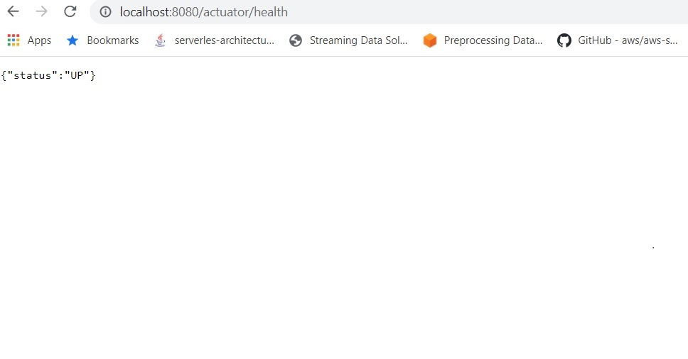

# Solution Overview

**Backend**

To tackle the problem at hand, *'full text search over all the attributes in a given dataset'*, the possibility is to use NoSQL document stores like Elasticsearch or MongoDB. Choose Elasticsearch over MongoDB as Elasticsearch is a specially designed full-text search engine, and it caters to large data sets. Whereas MongoDB is excellent at performing complex calculations and MapReduce jobs.

**Spring boot Microservice**

Spring Boot provides an easy way to interact with Elasticsearch through Spring Data repositories.
This microservcie includes unit test and integration testing. 
Please refer following for the test coverage report.
 
 
**API**

Using springdoc-openapi java library, reverse engineer and generated the OpenAPI specification.

```
{
   "openapi":"3.0.1",
   "info":{
      "title":"Maersk dataset search API ",
      "description":"OpenApi (Swagger) documentation auto generated from code",
      "version":"1.0"
   },
   "servers":[
      {
         "url":"http://localhost:8080",
         "description":"Generated server url"
      }
   ],
   "tags":[
      {
         "name":"Maersk Search API",
         "description":"Documentation for Maersk Search API"
      }
   ],
   "paths":{
      "/v1/search":{
         "get":{
            "tags":[
               "Maersk Search API"
            ],
            "summary":"Search by attribute value",
            "description":"Search by attribute value",
            "operationId":"search",
            "parameters":[
               {
                  "name":"attribute",
                  "in":"query",
                  "description":"Attribute to be find",
                  "required":true,
                  "schema":{
                     "type":"string"
                  }
               },
               {
                  "name":"value",
                  "in":"query",
                  "description":"Value to be find",
                  "required":true,
                  "schema":{
                     "type":"string"
                  }
               },
               {
                  "name":"page",
                  "in":"query",
                  "description":"Page number (for pagination)",
                  "required":false,
                  "schema":{
                     "type":"integer",
                     "format":"int32",
                     "default":0
                  }
               },
               {
                  "name":"size",
                  "in":"query",
                  "description":"Number of items per page (for pagination)",
                  "required":false,
                  "schema":{
                     "type":"integer",
                     "format":"int32",
                     "default":10
                  }
               }
            ],
            "responses":{
               "404":{
                  "description":"No data found",
                  "content":{
                     "*/*":{
                        "schema":{
                           "type":"object"
                        }
                     }
                  }
               },
               "200":{
                  "description":"Successful operation",
                  "content":{
                     "*/*":{
                        "schema":{
                           "type":"object"
                        }
                     }
                  }
               },
               "400":{
                  "description":"Bad Request ",
                  "content":{
                     "*/*":{
                        "schema":{
                           "type":"object"
                        }
                     }
                  }
               }
            }
         }
      }
   },
   "components":{
      
   }
}
```
Swagger API definition

 
 
To monitor the operational status of the microservice health check endpoint exposed.



## Build and Deploy process

**Prerequisites**

For the demonstration purpose, the microservice ingests a sample dataset to Elasticsearch when the server starts. Also, the integration test suite needs to load a test dataset to Elasticsearch. Therefore, the Elasticsearch cluster needs to be ready for the microservice.

Strat Elasticsearch Cluster

A simple Docker compose file ([docker-compose.yaml](docker-compose.yaml)) is provided to start Elasticsearch cluster. Future scalability can be achieved by adding new nodes.

```
version: "3.7"

networks:
 dev-net:
  name: dev-net
  driver: bridge

services:
  elasticsearch:
    image: elasticsearch:7.8.0
    container_name: elasticsearch
    restart: unless-stopped
    networks:
      - dev-net
    ports:
      - "9200:9200"
      - "9300:9300"
    environment:
      discovery.type: single-node  
```

`> docker compose up -d`

Make sure Elasticsearch cluster is up and running

 

**Build procees**

Gradle is used as the build tool.

Make sure you the commands from project root directory

To run tests

`>./gradlew clean test`

To build 

`>./gradlew clean build`

**Run the server**

`>java -jar build/libs/data-search-api-1.0.0.jar`


To Dockerize the microservice simple ([Dockerfile](Dockerfile)) included.

```
FROM openjdk:14
MAINTAINER Muditha Silva
COPY build/libs/data-search-api-1.0.0.jar data-search-api-1.0.0.jar
ENTRYPOINT ["java","-jar","/data-search-api-1.0.0.jar"]

```
Postman collection  ([search-api-postman_collection.json](search-api-postman_collection.json))  for teting the API.

## Further improvements
- Packing Microservice in a Docker container and deploying to Kubernetes cluster.
- Add Jenkinsfile for jenkin based ci/cd pipeline
- API authantication and Elasticsearch index (dataset) based autharization.
- Add Kibana for data visualization
